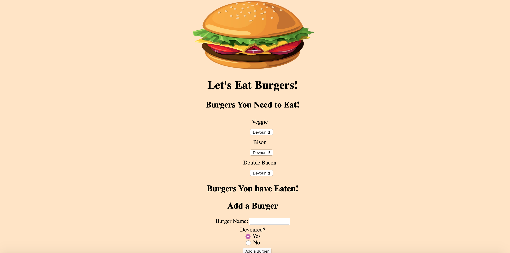

# EatDaBurger
The objective of this assingment was to create a Full Stack app called "Eat Da Burger" which allows the user to add burgers they wish to "devour" to a 
list. Once they select the "devour" button, the burger is consumed and moved to the list of burgers that have been eaten by the user. The actions
of adding and devouring burgers on the app also update the MySQL server database. 

This assignment revolved around ORM utilization, MySQL, handlebars, and altering a database using a front-end application. It was challenging, 
but definitely a great experience to create a Full Stack App. 

Here is a link to the deployed App on Heroku: 
https://stormy-reef-34667.herokuapp.com/

Here is a link to the GitHub repository: 
https://github.com/laurendoss/EatDaBurger

And finally, here is a screenshot of the deployed app: 
